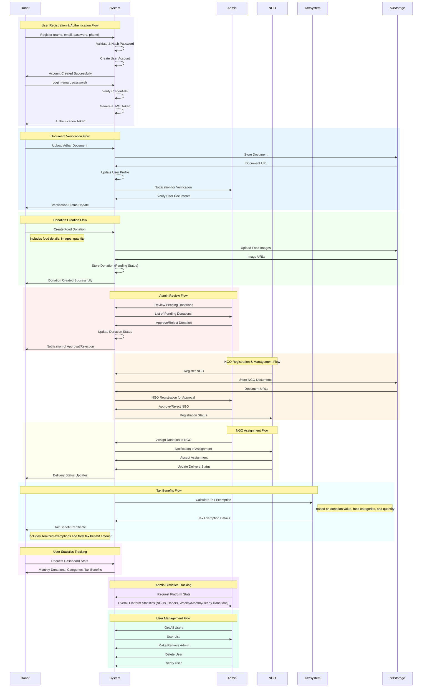

# AAHAAR: Food Donation Platform

AAHAAR is a food donation platform that connects food donors with NGOs and individuals in need. The platform helps reduce food waste by facilitating the donation of excess food to those who need it most.

## 🚀 Features

- User Authentication (Donors, NGOs, and Recipients)
- Food Donation Management
- Real-time Food Availability Tracking
- Location-based Food Distribution
- Contact Information Management
- Food Category Classification
- Status Tracking (Pending, In Transit, Delivered)

## 🛠 Tech Stack

### Backend

- Node.js
- Express.js
- MongoDB with Mongoose
- JWT Authentication
- AWS S3 (for image storage)

### Frontend

- React.js
- Redux (State Management)
- Material-UI (UI Components)
- Axios (API Calls)

## 📁 Project Structure

```
Aahaar/
├── 📁 backend/
│   ├── 📁 controllers/
│   │   ├── 📄 adminController.js
│   │   ├── 📄 foodInfoController.js
│   │   ├── 📄 ngoController.js
│   │   ├── 📄 statsController.js
│   │   ├── 📄 taxController.js
│   │   ├── 📄 userController.js
│   │   └── 📄 userStatsController.js
│   ├── 📁 middlewares/
│   │   ├── 📄 asyncHandler.js
│   │   ├── 📄 authMiddleware.js
│   │   ├── 📄 errorHandler.js
│   │   └── 📄 isAdmin.js
│   ├── 📁 models/
│   │   ├── 📄 foodInfoModel.js
│   │   ├── 📄 ngoModel.js
│   │   ├── 📄 taxModel.js
│   │   └── 📄 userModel.js
│   ├── 📁 node_modules/ 🚫 (auto-hidden)
│   ├── 📁 routes/
│   │   ├── 📄 FoodInfoRoute.js
│   │   ├── 📄 adminRoutes.js
│   │   ├── 📄 ngoRoutes.js
│   │   ├── 📄 statsRoutes.js
│   │   ├── 📄 userRoutes.js
│   │   └── 📄 userStatsRoutes.js
│   ├── 📁 utils/
│   │   ├── 📄 db.js
│   │   ├── 📄 seedAdmin.js
│   │   └── 📄 token.js
│   ├── 🔒 .env 🚫 (auto-hidden)
│   ├── 🚫 .gitignore
│   ├── 📖 README.md
│   ├── 🖼️ logo.png
│   ├── 📄 package-lock.json
│   ├── 📄 package.json
│   ├── 📄 s3Config.js
│   ├── 📄 server.js
│   └── 📄 testing.js
└── 📖 README.md
```

## 🚀 Getting Started

### Backend Setup

1. Navigate to backend directory:

   ```bash
   cd backend
   ```

2. Install dependencies:

   ```bash
   npm install
   ```

3. Create `.env` file with required variables:

   ```
   MONGO_URI=your_mongo_connection_string
   JWT_SECRET=your_jwt_secret
   PORT=5000
   AWS_ACCESS_KEY_ID=your_aws_access_key
   AWS_SECRET_ACCESS_KEY=your_aws_secret_key
   AWS_BUCKET_NAME=your_s3_bucket_name
   ```

4. Start the development server:
   ```bash
   npm run dev
   ```

### Frontend Setup

1. Navigate to frontend directory:

   ```bash
   cd frontend
   ```

2. Install dependencies:

   ```bash
   npm install
   ```

3. Start the development server:
   ```bash
   npm start
   ```

## 📝 API Endpoints

### Food Information

- `POST /api/foodInfo/createFoodInfo` - Create new food donation
- `GET /api/foodInfo/getFoodInfo` - Get all food donations
- `GET /api/foodInfo/getFoodInfoById/:id` - Get specific food donation
- `PUT /api/foodInfo/updateFoodInfo/:id` - Update food donation
- `DELETE /api/foodInfo/deleteFoodInfo/:id` - Delete food donation

### User Management

- `POST /api/users/register` - Register new user
- `POST /api/users/auth` - User login
- `POST /api/users/logout` - User logout

### NGO Management

- `POST /api/ngo/aahaarNgoDocumentsUpload` - Upload NGO documents
- `POST /api/ngo/aahaarNgoDetails` - Register NGO details

## 📄 License

Licensed under the MIT License.

## 🤝 Contributing

Contributions are welcome! Please feel free to submit a Pull Request.


