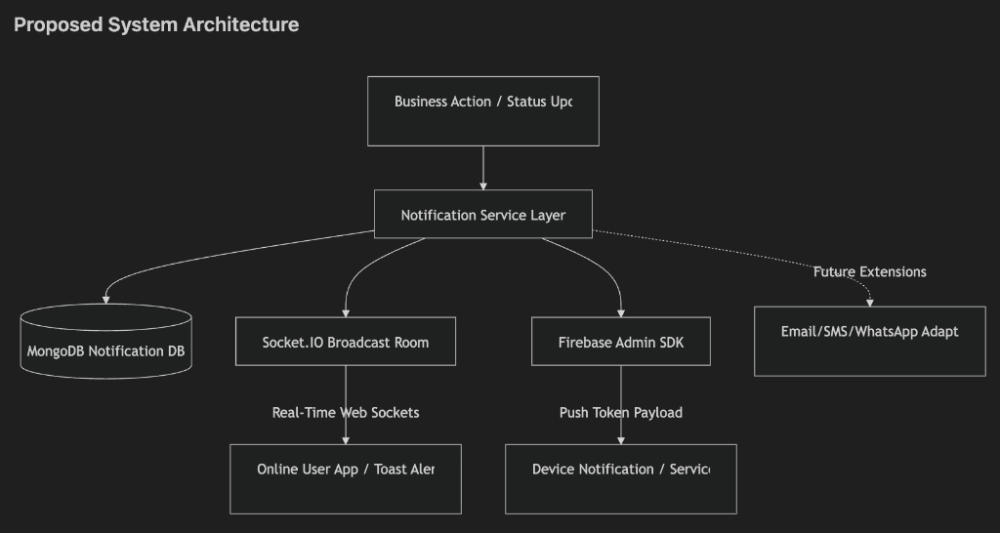
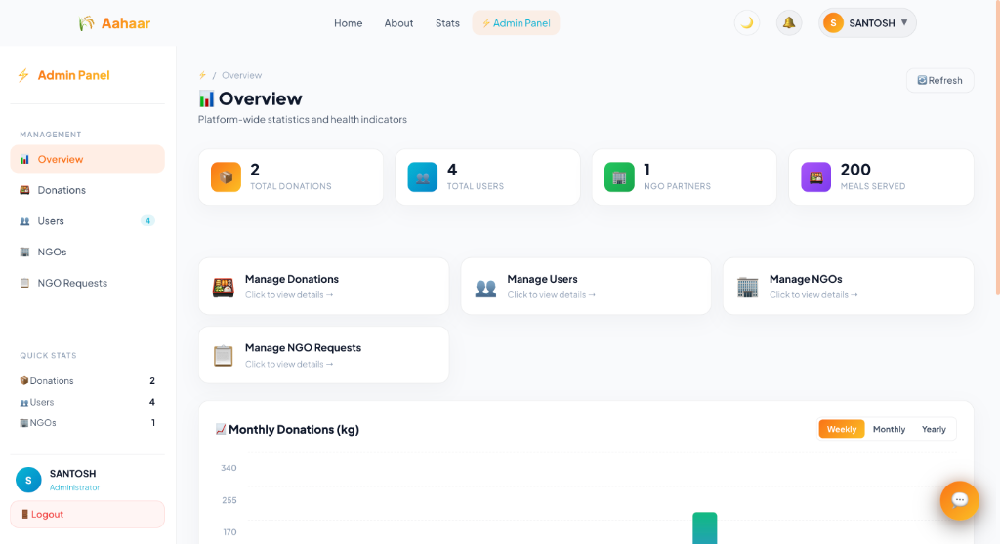
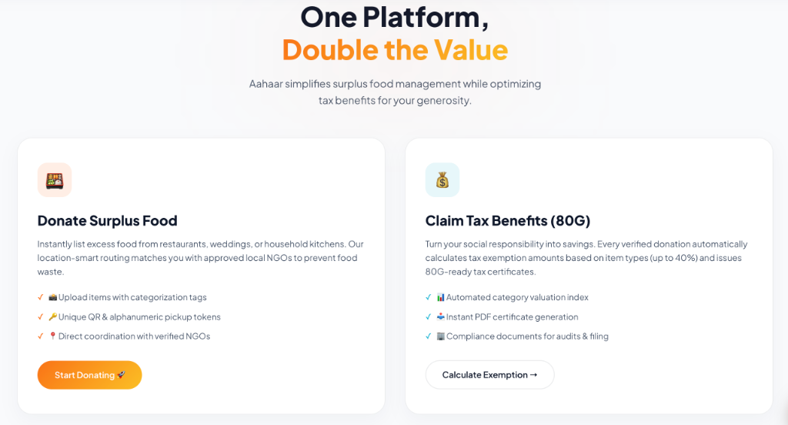
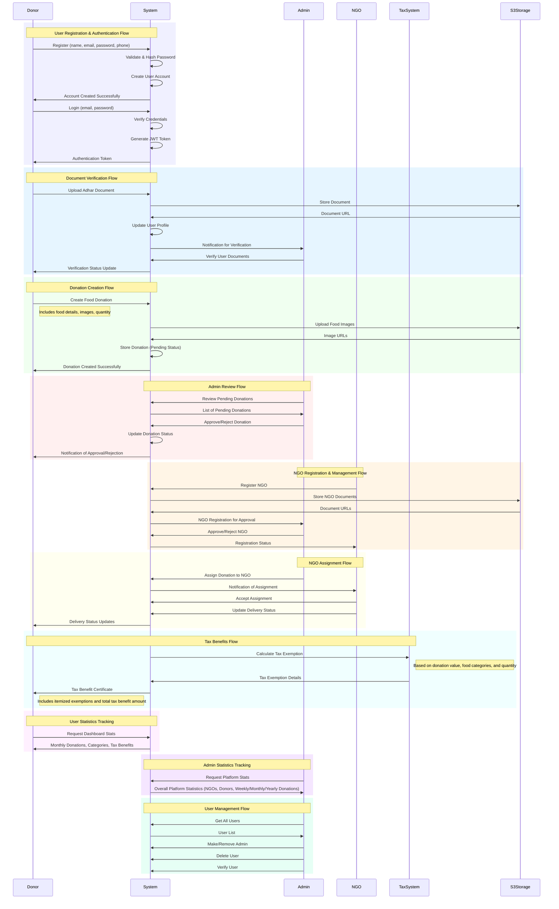

# AAHAAR: Donation Orchestration & Tax Benefit Platform

<p align="center">
  
</p>

<p align="center">
  <a href="#-features">Features</a> •
  <a href="#-system-architecture">Architecture</a> •
  <a href="#-functional-workflows">Workflows</a> •
  <a href="#-section-80g-tax-exemption">Tax Exemption</a> •
  <a href="#-tech-stack">Tech Stack</a> •
  <a href="#-getting-started">Getting Started</a> •
  <a href="#-api-endpoints">API Endpoints</a>
</p>

---

**AAHAAR** is a comprehensive, full-stack surplus food rescue, routing logistics, and tax benefit orchestration platform. By bridging the gap between food donors (wedding halls, restaurants, hotels, corporate kitchens, and individuals) and verified local non-governmental organizations (NGOs), Aahaar minimizes food waste while feeding underserved communities in real-time.


---

## 🚀 Key Features

* **Multi-Portal Experience**: Separate interactive dashboards for Donors, NGOs, and Administrators.
* **Document Verification Protocol**: Aadhaar validation for donors and registration certificate checks for NGOs via AWS S3 storage.
* **Real-time Status Tracking**: Instant status syncing (Pending, In Transit, Delivered) for all active donations.
* **Automated Exemption Module**: Built-in 80G tax benefit calculation and certificate generation.
* **Location-based Routing**: Matches surplus food listings with nearest certified NGOs.
* **Analytical Dashboards**: Aggregates weekly, monthly, and yearly statistics (meals served, active partners, total weight).

---

## 📊 System Architecture

The platform features a hybrid real-time alert and background push notification delivery pipeline utilizing **Socket.IO** for live, interactive dashboard notifications and **Firebase Cloud Messaging (FCM)** for background notifications when browser tabs are closed:



---

## 🔄 Functional Workflows

### 1. Donor Portal (How it works & Donating)
* **Onboarding**: Users create an account and upload their Aadhaar Card to verify donor identity.
* **Surplus Listing**: Donors submit food listings by providing description tags, categories (e.g. Cooked Meals, Grains, Bakery items), shelf life/expiry time, and pictures.
* **Status Updates**: Donors can track who picked up their donation and check delivery history.
* **Impact Tracking**: Personalized donor dashboard displays total donations created, success rate percentage, and meals served.

### 2. NGO Portal (Claim & Onboard)
* **Registration**: NGOs register with PAN credentials and operational cities, uploading registration certificates for administrative verification.
* **Request Pipeline**: NGO representatives can view nearby available donations or submit custom food requests for local distribution drives.
* **Fulfillment Management**: NGOs claim allocations, manage transport pickup times, and update fulfillment statuses.

### 3. Admin Control Panel (Verification & Routing)
* **Credential Verification**: Admins audit donor Aadhaar cards and NGO registration certificates.
* **Logistic Assignment**: Match and assign approved food listings to active nearby NGO distribution partners.
* **System Metrics Monitoring**: Review platform-wide statistics like total active users, registered NGOs, and cumulative meals served.



---

## 🧾 Section 80G Tax Exemption

Aahaar simplifies social responsibility by offering tangible tax savings to verified donors under Section 80G.



* **Dynamic Exemption Calculation**: Automatically computes deduction indexes (up to 40%) based on food categories, quantity, and audited commercial values.
* **Automated Certificate Generation**: Issues itemized, audit-ready PDF tax benefit certificates directly to the donor's profile upon successful delivery confirmation by the receiving NGO.

---

## 🛠 Tech Stack

| Layer | Technologies Used |
| :--- | :--- |
| **Frontend** | React.js, Redux (State Management), Material-UI (UI Library), Axios (API Client) |
| **Backend** | Node.js, Express.js (REST APIs), JWT (Authentication) |
| **Database & Storage** | MongoDB with Mongoose (Schemas & Queries), AWS S3 (Secure Document Hosting) |

---

## 📁 Project Structure

```
Aahaar/
├── 📁 backend/
│   ├── 📁 controllers/         # Logic handlers for users, stats, NGOs, tax, admin
│   ├── 📁 middlewares/         # Auth verification, role checkers, async wrappers
│   ├── 📁 models/              # Mongoose database schemas
│   ├── 📁 routes/              # Express endpoint routers
│   ├── 📁 utils/               # Database setup, admin seed scripts, token generation
│   ├── 📄 server.js            # Node backend entry point
│   └── 📄 s3Config.js          # AWS S3 integration
├── 📁 frontend/
│   ├── 📁 src/
│   │   ├── 📁 components/      # Chatbot, Navbar, and layout widgets
│   │   ├── 📁 pages/           # Admin, Donor, NGO Dashboards, and landing views
│   │   └── 📄 main.jsx         # Vite react entry point
└── 📁 images/                  # Platform screenshot assets
```

---

## 🚀 Getting Started

### Backend Setup
1. Navigate to the backend directory:
   ```bash
   cd backend
   ```
2. Install dependencies:
   ```bash
   npm install
   ```
3. Create a `.env` file in the root of the backend folder:
   ```env
   MONGO_URI=your_mongodb_connection_string
   JWT_SECRET=your_jwt_secret
   PORT=5000
   AWS_ACCESS_KEY_ID=your_aws_access_key
   AWS_SECRET_ACCESS_KEY=your_aws_secret_key
   AWS_BUCKET_NAME=your_s3_bucket_name
   ```
4. Run the development server:
   ```bash
   npm run dev
   ```

### Frontend Setup
1. Navigate to the frontend directory:
   ```bash
   cd frontend
   ```
2. Install dependencies:
   ```bash
   npm install
   ```
3. Start the application:
   ```bash
   npm start
   ```

---

## 📝 API Endpoints

### Food Information
* `POST /api/foodInfo/createFoodInfo` - Create a new food donation
* `GET /api/foodInfo/getFoodInfo` - Retrieve all food donations
* `GET /api/foodInfo/getFoodInfoById/:id` - Fetch details for a specific donation
* `PUT /api/foodInfo/updateFoodInfo/:id` - Update food donation details
* `DELETE /api/foodInfo/deleteFoodInfo/:id` - Remove a food donation listing

### User Management
* `POST /api/users/register` - Create a new donor/user account
* `POST /api/users/auth` - Login user and generate access token
* `POST /api/users/logout` - Logout user and clear session

### NGO Management
* `POST /api/ngo/aahaarNgoDocumentsUpload` - Upload NGO documentation to AWS S3
* `POST /api/ngo/aahaarNgoDetails` - Register PAN card and operational credentials

---

## 🤝 Contribution & Licenses
Contributions are highly welcomed. Please feel free to open issues or submit pull requests. Licensed under the MIT License.

---

## 📊 Sequence Diagram (System Logistics)


```mermaid
%%{init: {'theme': 'default', 'themeVariables': { 'actorMargin': 50, 'boxMargin': 10, 'messageMargin': 35, 'mirrorActors': false, 'bottomMarginAdj': 1, 'noteMargin': 10 }}}%%

sequenceDiagram
    participant Donor
    participant System
    participant Admin
    participant NGO
    participant TaxSystem
    participant S3Storage

    %% User Registration & Authentication Flow
    rect rgb(240, 240, 255)
    Note over Donor, System: User Registration & Authentication Flow
    Donor->>System: Register (name, email, password, phone)
    System->>System: Validate & Hash Password
    System->>System: Create User Account
    System->>Donor: Account Created Successfully
    Donor->>System: Login (email, password)
    System->>System: Verify Credentials
    System->>System: Generate JWT Token
    System->>Donor: Authentication Token
    end

    %% Document Verification Flow
    rect rgb(230, 245, 255)
    Note over Donor, System: Document Verification Flow
    Donor->>System: Upload Adhar Document
    System->>S3Storage: Store Document
    S3Storage->>System: Document URL
    System->>System: Update User Profile
    System->>Admin: Notification for Verification
    Admin->>System: Verify User Documents
    System->>Donor: Verification Status Update
    end

    %% Donation Creation Flow
    rect rgb(240, 255, 240)
    Note over Donor, System: Donation Creation Flow
    Donor->>System: Create Food Donation
    Note right of Donor: Includes food details, images, quantity
    System->>S3Storage: Upload Food Images
    S3Storage->>System: Image URLs
    System->>System: Store Donation (Pending Status)
    System->>Donor: Donation Created Successfully
    end

    %% Admin Review Flow
    rect rgb(255, 240, 240)
    Note over Admin, System: Admin Review Flow
    Admin->>System: Review Pending Donations
    System->>Admin: List of Pending Donations
    Admin->>System: Approve/Reject Donation
    System->>System: Update Donation Status
    System->>Donor: Notification of Approval/Rejection
    end

    %% NGO Registration & Management Flow
    rect rgb(255, 245, 230)
    Note over Admin, NGO: NGO Registration & Management Flow
    NGO->>System: Register NGO
    System->>S3Storage: Store NGO Documents
    S3Storage->>System: Document URLs
    System->>Admin: NGO Registration for Approval
    Admin->>System: Approve/Reject NGO
    System->>NGO: Registration Status
    end

    %% NGO Assignment Flow
    rect rgb(255, 255, 240)
    Note over Admin, NGO: NGO Assignment Flow
    Admin->>System: Assign Donation to NGO
    System->>NGO: Notification of Assignment
    NGO->>System: Accept Assignment
    NGO->>System: Update Delivery Status
    System->>Donor: Delivery Status Updates
    end

    %% Tax Benefits Flow
    rect rgb(240, 255, 255)
    Note over Donor, TaxSystem: Tax Benefits Flow
    System->>TaxSystem: Calculate Tax Exemption
    Note right of TaxSystem: Based on donation value, food categories, and quantity
    TaxSystem->>System: Tax Exemption Details
    System->>Donor: Tax Benefit Certificate
    Note right of Donor: Includes itemized exemptions and total tax benefit amount
    end

    %% User Statistics Tracking
    rect rgb(255, 240, 255)
    Note over Donor, System: User Statistics Tracking
    Donor->>System: Request Dashboard Stats
    System->>Donor: Monthly Donations, Categories, Tax Benefits
    end

    %% Admin Statistics Tracking
    rect rgb(245, 230, 255)
    Note over Admin, System: Admin Statistics Tracking
    Admin->>System: Request Platform Stats
    System->>Admin: Overall Platform Statistics (NGOs, Donors, Weekly/Monthly/Yearly Donations)
    end

    %% User Management Flow
    rect rgb(230, 255, 245)
    Note over Admin, System: User Management Flow
    Admin->>System: Get All Users
    System->>Admin: User List
    Admin->>System: Make/Remove Admin
    Admin->>System: Delete User
    Admin->>System: Verify User
    end
```
